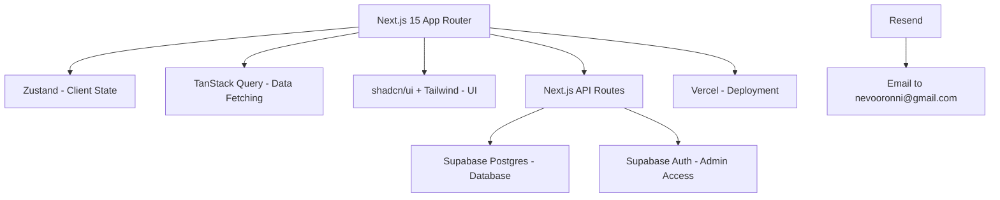

# Project Plan: Neville Oronni Modern Portfolio (V3)

A high-performance, SaaS-style portfolio designed to position Neville Oronni as a seasoned Staff Engineer and Technical Lead. This project replaces the legacy portfolio with a modern UI/UX, impact-driven copywriting, and a robust Next.js 15 architecture.

## User Stories & Feature Breakdown

### 1. Hero & Brand Identity
- **User Story**: As a FAANG recruiter, I want to immediately see Neville's seniority level and professional impact.
- **Features**:
  - High-impact headline focusing on technical leadership and scaling systems.
  - "Mission-critical" systems value proposition.
  - Quick access to CV (Preview & Download).
  - **CV Source**: `/Users/nevooronni/Downloads/Nevo_Full_Stack_micro1_CV.pdf`.

### 2. Strategic Impact & Experience
- **User Story**: As a CTO/Director, I want to see the ROI and strategic value Neville has delivered.
- **Features**:
  - **Metrics Dashboard**: Visual charts (Recharts) showing quantified impact:
    - **50% YoY Revenue Growth** (Lemonade Payments).
    - **40% Latency Reduction** (API optimization).
    - **32% Bug Reduction** (via 75% test coverage).
    - **25% Traffic Boost** (via mobile performance).
  - **Professional Timeline**: Focus on **Engineering Team Leader** (Lemonade) and **Lead/Senior** roles (Workpay, Twiga).
  - **Data Source**: CV and old portfolio `content.js`.

### 3. Case Studies (Project History)
- **User Story**: As an interviewer, I want to see deep-dives into complex technical challenges.
- **Features**:
  - Detailed case studies for Babbel, Lemonade, Workpay, etc.
  - Tech stack tags, architecture diagrams (SVG), and outcome descriptions.
  - Live links and repo placeholders.

### 4. Technical Skills & Services
- **User Story**: As a client, I want to know exactly what technical domains Neville excels in.
- **Features**:
  - Categorized skill grid (Backend, Mobile, Cloud, DevOps).
  - "Strategic Services" section (Architecture Design, Team Mentorship, Fintech Integration).
  - **Data Source**: Combined from CV and legacy portfolio.

### 5. Admin & Content Management
- **User Story**: As a portfolio owner, I want to manage my content without redeploying code.
- **Features**:
  - **Secure Login**: Access for Neville only (Supabase Auth).
  - **Project Editor**: CRUD operations for projects, tech tags, and metrics.
  - **Experience Manager**: CRUD operations for employment history and accomplishment bullets.
  - **Dashboard Metrics**: Interface to update key impact numbers displayed on the homepage.
  - **Message Inbox**: View and manage submissions from the contact form.

### 6. Contact & Lead Generation
- **User Story**: As an agency, I want a frictionless way to reach out.
- **Features**:
  - Contact form with Zod validation.
  - **Email Routing**: Sends messages directly to `nevooronni@gmail.com`.
  - Direct links to GitHub, LinkedIn.

## System Architecture



## Folder Structure

```text
/src
  /app
    /(public)       # Public routes (Home, Projects, About)
    /(admin)        # Protected admin routes (Dashboard)
    /api            # Next.js API Routes
  /components
    /ui             # Pure UI components (shadcn)
    /shared         # Reusable site-wide components
    /features       # Feature-specific components (ProjectCard, ImpactChart)
  /hooks            # Custom React hooks
  /lib              # Utility functions, supabase client
  /store            # Zustand store
  /types            # TypeScript definitions
  /data             # Static content (from old content.js)
  /styles           # Global CSS
```

## Data Model (Supabase Schema)

### `projects`
- `id`: uuid (PK)
- `title`: string
- `description`: text (impact-focused)
- `tech_stack`: string[]
- `metrics`: jsonb (e.g., { "performance": "+40%", "users": "1M+" })
- `image_url`: string
- `live_link`: string
- `github_link`: string
- `order`: integer

### `experience`
- `id`: uuid
- `company`: string
- `role`: string (Staff/Lead/Senior)
- `start_date`: date
- `end_date`: date (null if current)
- `accomplishments`: string[] (ROI focused)

## Authentication & Authorization
- **Supabase Auth**: Used for Neville to log in and manage testimonials or live project data.
- **Protected Routes**: `/admin` sections for content management.

## Third-Party Services
- **Supabase**: Database, Auth (Free Tier).
- **Vercel**: Hosting and serverless functions (Free).
- **Resend**: Email notifications from contact form (Free).
- **Cloudinary/Supabase Storage**: Project images and CV hosting (Free).

## Estimated Tasks

### Phase 1: Setup
- [ ] Initialize Next.js 15 project with TS, Tailwind, and Shadcn.
- [ ] Configure ESLint, Prettier, Husky.
- [ ] Set up Supabase project and environment variables.

### Phase 2: Design System & Core UI
- [ ] Implement Archivo/Space Grotesk typography.
- [ ] Create core layout (Nav, Footer, Glassmorphism Hero).
- [ ] Build project grid and experience timeline.

### Phase 3: Copywriting & Content
- [ ] Rewrite project descriptions for "Staff Engineer" level.
- [ ] Populate data from old `content.js` and CV.
- [ ] Implement Recharts for the impact dashboard.

### Phase 4: Backend & Admin
- [ ] Connect Supabase for project fetching.
- [ ] Build contact form with Zod/React Hook Form.
- [ ] Implement PDF preview/download for CV.

### Phase 5: Polish & Deployment
- [ ] Accessibility audit (WCAG 2.2 AA).
- [ ] SEO optimization (Meta tags, JSON-LD).
- [ ] Deploy to Vercel.

## Open Questions & Dependencies
- [RESOLVED] **CV Location**: `/Users/nevooronni/Downloads/Nevo_Full_Stack_micro1_CV.pdf` (Processed).
- **Free Domain Suggestion**: 
  - **GitHub Student Developer Pack**: Get `.tech`, `.me`, and `.com` for free for 1 year.
  - **Freenom**: Historically provided free `.tk`, `.ml`, `.ga`.
  - **Vercel/Cloudflare**: Provide excellent free subdomains (e.g., `nevilleoronni.vercel.app`).
  - **Promo Codes**: Look for $0.99 first-year offers on Namecheap/Porkbun for `.tech`.
- **Supabase Account**: I'll use the free tier for Database and Auth.
- **Email**: Resend (Free tier) configured to send to `nevooronni@gmail.com`.

## Verification Plan
- **Performance**: Lighthouse/Core Web Vitals scores > 90.
- **A11y**: Manual sweep with screen reader + automated axe testing.
- **Responsive**: Test on Mobile (iPhone 13), Tablet, and Desktop (4K).
- **Functional**: Verify contact form and CV download work as expected.
